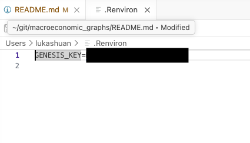

## Requirements
Most R package dependencies are installed automatically on first run via `pacman::p_load` (see [src/theme.R](src/theme.R)): `tidyverse`, `sf`, `ggplot2`, `extrafont`, `patchwork`, `countrycode`, `scales`, `ggrepel`, `ggnewscale`, `rnaturalearth`, `rnaturalearthdata`, `WDI`, `readxl`, `httr`, `jsonlite`, and `xml2`.

`restatis` and `httr2` are loaded by [src/bootstrap.R](src/bootstrap.R). The `seasonal` package is required by graphs that perform X-13ARIMA-SEATS adjustment locally.

Install the packages loaded or used outside that automatic list before the first run:

```r
install.packages(c("restatis", "httr2", "seasonal", "usethis"))
```

## Log In
This project relies on Genesis for most of its data. GENESIS is a German government database that requires a free account to access. You can create an account on the [GENESIS website](https://genesis.destatis.de/datenbank/online/).

GENESIS requires credentials configured once when first using the project.

The preferred method is using a token. You can get a token from the [GENESIS website](https://genesis.destatis.de/datenbank/online/).


Then run the following in R:
```r
restatis::gen_auth_save("genesis", use_token = TRUE)
```


Enter the token when prompted. 


After authenticating to GENESIS, it will print a message with the genesis key. Please save this key to your `~/.Renviron` file as `GENESIS_KEY=<your key>` to avoid having to re-enter it in future sessions. You can edit your `~/.Renviron` file with usethis, enter your GENESIS_KEY, and save the file. Then restart R to load the new environment variable.
```r
library(usethis)
usethis::edit_r_environ()
```




If, instead , you want to authenticate with your username and password, run the following in R:
```r
restatis::gen_auth_save("genesis")
```

Zensus 2022 can be configured in the same way by replacing `"genesis"` with `"zensus"`.
## Usage
Run one of the following commands in the project terminal to generate graphs.
 

```bash
# Interactive menu — lists all graphs by category, prompts for a selection
Rscript src/cli.R

# Generate every graph
Rscript src/cli.R all

# Generate one category (matches the categories shown in the menu)
Rscript src/cli.R gdp
Rscript src/cli.R employment
Rscript src/cli.R prices
Rscript src/cli.R trade

# Generate specific graphs by menu number, list, and/or range
Rscript src/cli.R 1,3,5-7

# Generate a graph by its stable ID
Rscript src/cli.R ger_bip_annual_growth

# Run and debug one graph module directly (renders its related outputs)
Rscript src/graphs/gdp/ger_bip_annual.R

# Use a custom start year instead of the default (2000) — output goes to
# out/custom start <YYYY>/ so it never overwrites the standard graphs
Rscript src/cli.R --start-year=1995 gdp

# Put all selected files directly in out/monthly-report/ (no category or
# language subfolders) and render English labels only
Rscript src/cli.R --output-folder=monthly-report --language=en gdp
```

In the interactive menu you can also enter numbers, comma-separated lists, ranges (`5-7`), category names, or `all`. The options can be combined with interactive or non-interactive selections:

- `--start-year=YYYY` changes the earliest year for graph modules that use `DATA_START_YEAR`. Fixed-period and snapshot graphs are unaffected.
- `--output-folder=NAME` writes every selected file directly into `out/NAME/`, without the normal category and language subfolders. `NAME` must be a single folder name, not a path.
- `--language=de|en` renders only German or English labeling. The full names `german` and `english` are also accepted.

When `--start-year` and `--output-folder` are combined, the explicit output folder takes precedence. Snapshot-style charts (e.g. trade structure pies and country choropleths, which always show the latest year) are unaffected by `--start-year`.

Category-specific batch scripts are also available for partial refreshes:

```bash
Rscript src/run_gdp.R
Rscript src/run_employment_prices.R
Rscript src/run_trade.R
```

The main CLI reports per-graph success/failure. The category-specific batch scripts report failures; in both cases, a failure in one graph doesn't stop the rest of the batch.

## Adding new graphs

For more information on how to add a new graph, see [ADDING_GRAPHS.md](ADDING_GRAPHS.md).

## Output

Charts are written to the output folders specified by each graph module, normally:

```
out/<category-folder>/German labeling/<title>.jpeg
out/<category-folder>/English labeling/<title>.jpeg
```

The current category-folder names are `GDP graphs`, `employment graphs`, `prices graphs`, and `trade graphs`. A small number of Prices modules currently use `Prices graphs` with an uppercase `P`, so those files may appear in a separate directory on case-sensitive file systems.

e.g. `out/GDP graphs/English labeling/GER BIP annual growth - chain index_en.jpeg`.

Runs with `--start-year=YYYY` write to `out/custom start <YYYY>/<category-folder>/...` instead, keeping the standard output untouched.

Runs with `--output-folder=NAME` output all graphs into `out/NAME/`. Add `--language=de` or `--language=en` to generate only one label variant.


#### Developer Note
Fetched data is cached to `cache/<key>.rds` so repeated runs don't re-hit the data sources. For modules that use `DATA_START_YEAR`, a different `--start-year` produces different cache keys, so those modules fetch fresh data rather than reusing the default run's cache. Delete the relevant `.rds` file (or call `bust_cache()` in an R session) to force a refetch.

## Project structure

```
src/
  cli.R                   User Interface
  run_gdp.R               Batch runner: GDP graphs only
  run_employment_prices.R Batch runner: Employment + Prices graphs
  run_trade.R             Batch runner: Trade graphs only
  bootstrap.R             Loads packages and sources every module below
  config.R                Global constants (start year, paths, render defaults)
  graph_modules.R         Discovers, validates, and runs self-contained graph modules
  render.R                ggsave wrapper used by every graph
  theme.R                 HWWI brand colors and shared ggplot2 theme
  fetch/                  Data source adapters (GENESIS, WDI, Bundesbank, Excel) + cache
  transform/               Reusable data transforms (YoY growth, rebasing, seasonal adj.)
  plot/                   Chart-type builders (timeseries, bar, choropleth, pie, ...)
  graphs/
    gdp/                  GDP graph specs
    employment/           Employment graph specs
    prices/               Prices graph specs
    trade/                Trade graph specs
```
